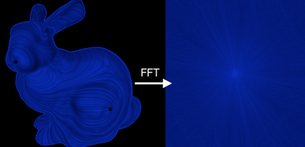

# Fourier Transform 
Implements the Cooley–Tukey FFT algorithm to reconstruct images with specified % of frequencies. 

Requires Eigen 3.2.4 and assumes it is in /usr/local/Cellar/eigen/3.2.4/include/eigen3/. Also requires ImageMagick and assumes it is in /usr/local/Cellar/imagemagick/6.9.2-3/include/ImageMagick-6
